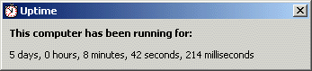



## Computer Uptime

### Description

Here's a silly little app that will tell you how many days, hours, minutes, seconds, and milliseconds that Windows has been running.
 
### More Info
 
The count gets all screwed up after a month of uptime, but you don't need to worry about that unless you are running NT. [a real OS ;)]

             |
---                |---
**Submitted On**   |2001-03-16 17:46:56
**By**             |[Doctor Evil](https://github.com/Planet-Source-Code/PSCIndex/blob/master/ByAuthor/doctor-evil.md)
**Level**          |Beginner
**User Rating**    |5.0 (20 globes from 4 users)
**Compatibility**  |VB 4\.0 \(32\-bit\), VB 5\.0, VB 6\.0
**Category**       |[Miscellaneous](https://github.com/Planet-Source-Code/PSCIndex/blob/master/ByCategory/miscellaneous__1-1.md)
**World**          |[Visual Basic](https://github.com/Planet-Source-Code/PSCIndex/blob/master/ByWorld/visual-basic.md)
**Archive File**   |[Coputer Up211656142001\.zip](https://github.com/Planet-Source-Code/doctor-evil-computer-uptime__1-24093/archive/master.zip)

